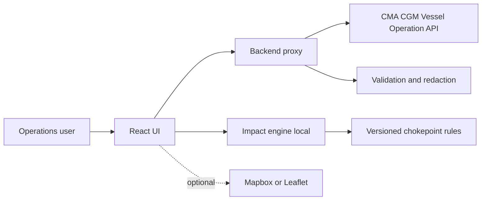
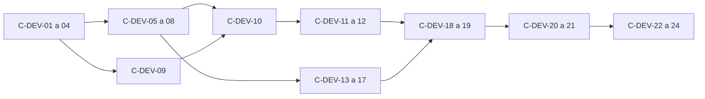

# Specification technique et fonctionnelle

## Exercice C - Disruption Navigator

**Statut :** blueprint avant implementation  
**Perimetre :** exclusivement Menu C  
**Sources :** guide participant AI Day - Hands-On 01 et 02, OpenAPI `vesseloperation.proforma.v2`, portail API CMA CGM public  
**Date :** 2026-09-10

> **Alerte securite.** Des identifiants Mapbox et une cle API ont ete fournis dans la conversation. Ils ne doivent jamais etre commites, inclus dans le frontend, une capture d'ecran ou ce document. Ils doivent etre revoques/renouveles par leur proprietaire, puis injectes uniquement via des variables d'environnement du serveur ou du fournisseur de deploiement.

## 0. Perimetre et vocabulaire

Le produit est une application web appelee **Disruption Navigator**. Elle permet a un utilisateur operations/shipping de :

1. choisir une paire de zones de depart et d'arrivee ;
2. charger les services CMA CGM disponibles pour cette paire ;
3. ouvrir un service et consulter son itineraire, ses ports, ses temps de transit et sa flotte ;
4. fermer virtuellement le canal de Suez ou le canal de Panama ;
5. voir immediatement quels services sont affectes et obtenir une estimation indicative de reroutage.

Le produit ne reserve pas de transport, ne modifie aucune donnee CMA CGM, ne reroute pas reellement un navire et ne doit jamais presenter une proposition comme une decision operationnelle validee.

---

## 1. Analyse de la documentation

### 1.1 Documents et sources lus

- Pages du guide concernant le cadre commun : run de 90 minutes, stack imposee, regles de securite, posture Copilot, autonomie et garde-fous.
- Page **Menu C - Disruption Navigator**.
- Page **Add an agent to your platform**, uniquement pour les contraintes communes de Hands-On 02.
- Page **Tips to get the most out of it**, uniquement pour les regles communes de validation.
- Page **Vibe coding**, uniquement pour la stack imposee et les trois regles communes.
- Fichier OpenAPI `vesseloperation.proforma.v2` joint.
- Portail API CMA CGM public indique dans la demande.

Les menus A et B ne sont pas des exigences du produit et sont volontairement exclus.

### 1.2 Exigences extraites de l'exercice C

| ID | Exigence | Provenance |
|---|---|---|
| C-01 | Construire un site Disruption Navigator. | Guide, Menu C, objectif |
| C-02 | Exploiter l'API CMA CGM Vessel Operation Proforma v2. | Guide, Menu C, objectif et Data |
| C-03 | Utiliser un proxy API pre-cable dans le starter lorsqu'il existe. | Guide, Menu C, Stack |
| C-04 | Utiliser des donnees API CMA CGM reelles ou un mode fixture clairement separe pour le developpement. | Guide, Menu C, Data |
| C-05 | Afficher une liste de services pour une paire de zones choisie. | Guide, prompt 1 |
| C-06 | Permettre le choix d'une zone de depart et d'une zone d'arrivee. | Guide, prompt 1 |
| C-07 | Gerer les etats loading et empty de la liste. | Guide, prompt 1 |
| C-08 | Afficher un code, un nom et un resume de service dans la liste. | Guide, prompt 1 et schema ServiceLight |
| C-09 | Rendre une carte de service cliquable. | Guide, prompt 2 |
| C-10 | Au clic, charger en parallele les escales proforma et la flotte du service. | Guide, prompt 2 |
| C-11 | Afficher les ports comme une timeline verticale. | Guide, prompt 2 |
| C-12 | Afficher les temps de transit dans cette timeline. | Guide, prompt 2 |
| C-13 | Afficher les navires de la flotte dans la vue detail. | Guide, prompt 2 et endpoint fleet |
| C-14 | Proposer un controle pour fermer le canal de Suez. | Guide, prompt 3 |
| C-15 | Proposer un controle pour fermer le canal de Panama. | Guide, prompt 3 |
| C-16 | Quand un toggle est actif, mettre visuellement en evidence les services qui traversent la zone affectee. | Guide, prompt 3 |
| C-17 | Afficher un badge de nombre de services perturbes. | Guide, prompt 3 |
| C-18 | Pour chaque service perturbe, afficher un panneau extensible d'impact. | Guide, prompt 4 |
| C-19 | L'impact doit estimer une route alternative via le Cap de Bonne-Esperance ou des routes alternatives. | Guide, prompt 4 |
| C-20 | L'impact doit estimer les jours supplementaires. | Guide, prompt 4 |
| C-21 | L'impact doit identifier le premier port affecte. | Guide, prompt 4 |
| C-22 | Le demo nominal est : fermer Suez, puis voir immediatement les services atteints. | Guide, objectif |
| C-23 | Le demo nominal est rejouable sans erreur d'affichage. | Guide, criteres minimum |
| C-24 | Au moins une vue detail doit fonctionner avec une donnee API. | Guide, criteres minimum |
| C-25 | L'API key ne doit pas apparaitre dans le code frontend. | Guide, criteres minimum et Security rules |
| C-26 | Un echec d'acces API documente reste un livrable acceptable si un mode fixture permet de demontrer le produit. | Guide, principes communs |
| C-27 | L'agent eventuel doit rester limite a un agent read-only qui observe/propose et n'agit pas seul. | Guide Hands-On 02 |
| C-28 | Chaque recommandation de reroutage doit etre etiquetee `[PROPOSAL]`. | Guide Hands-On 02, exemple Menu C |
| C-29 | Un reroutage reel est interdit ; une recommandation necessite validation humaine. | Guide Hands-On 02, garde-fous |
| C-30 | Un escalade est necessaire apres trois services critiques affectes. | Guide Hands-On 02, exemple Menu C |
| C-31 | L'agent doit lire une source publique et optionnelle en lecture seule. | Guide Hands-On 02, four boxes |
| C-32 | Utiliser VS Code + Copilot, Vite + React + Tailwind, avec Leaflet optionnel. | Guide, Menu C, Stack |
| C-33 | Le Mapbox fourni peut servir de fond cartographique, mais la carte est optionnelle et ne remplace pas les donnees de l'API. | Guide, Stack et parametres fournis |
| C-34 | Aucun secret, donnee interne ou donnee sensible ne doit etre mis dans un prompt, le frontend ou un commit. | Guide, regles de securite communes |

### 1.3 Objectifs metier

- Donner une lecture rapide de l'exposition d'un portefeuille de services a la fermeture d'un chokepoint.
- Transformer une reponse technique d'API en information operationnelle lisible.
- Permettre une discussion de scenario, pas une execution automatique.
- Rendre l'incertitude visible : donnees absentes, route heuristique et estimation doivent etre etiquetees.

### 1.4 Acteurs

| Acteur | Droits et responsabilites |
|---|---|
| Operations pilot | Choisit les zones, consulte les services, active les scenarios et lit l'impact. |
| Analyste/manager | Compare les impacts et utilise les informations pour une decision humaine. |
| Administrateur technique | Configure les secrets, le proxy, les fixtures et les logs. |
| API CMA CGM | Source read-only des services, escales et navires. |
| Agent Copilot optionnel | Produit des observations et propositions taguees, sans action externe. |

### 1.5 Contraintes techniques et donnees

- L'API amont expose des GET read-only.
- Base URL amont : `https://apis.cma-cgm.net/vesseloperation/proforma/v2`.
- Authentification amont possible par header `KeyId`; OAuth2 client credentials est aussi decrit. Le choix recommande pour le prototype est la cle cote serveur, jamais cote navigateur.
- Les endpoints de liste utilisent le header `range`, par defaut `0-49`, maximum 50 lignes.
- Les reponses peuvent etre `200` ou `206`, avec `Content-Range`.
- Les codes amont documentes incluent `400`, `404`, `416`, `500` et `default`.
- Les zones documentees sont `WEUR`, `ASIE`, `MED`, `CARAIBES`, `AFR`, `ANZPAC`, `MDLEAST`, `NA`, `SA`, `ALL`.
- Les donnees de l'API ne comportent pas de champ chokepoint explicite.

### 1.6 Inferences necessaires

La documentation ne definit pas de champ `chokepoint` dans `Service`, `ProformaCall` ou `Line`. La detection d'impact doit donc etre une **regle heuristique explicite**, basee sur les ports/UNLOCODE et une table de ports/chokepoints versionnee. Un resultat inconnu doit etre affiche comme `UNKNOWN`, jamais force a `AFFECTED`.

La documentation ne demande pas de persistence. Le choix par defaut est donc : etat de scenario en memoire du navigateur, cache de reponses court, aucun stockage de secret ni de donnee utilisateur en base. Une base n'est introduite que si un besoin d'historique est confirme plus tard.

---

## 2. Comprendre le produit final

### 2.1 Description

Une page operations responsive avec :

- une barre de contexte indiquant le titre, le statut API et le caractere simulation ;
- un panneau de selection `zoneFrom` / `zoneTo` ;
- une liste de services charges par cette paire ;
- un panneau de detail pour le service choisi ;
- deux toggles de disruption `Suez` et `Panama` ;
- un resume global du nombre de services affectes, potentiellement affectes et inconnus ;
- des panneaux d'impact extensibles pour les services affectes ;
- une carte optionnelle avec traces ou marqueurs, jamais requise pour le parcours minimum.

### 2.2 Scenario nominal

1. L'utilisateur ouvre l'application.
2. Les zones sont preselectionnees selon une paire configurable, par exemple `ASIE` vers `WEUR`.
3. Il clique sur `Charger les services`.
4. Le frontend appelle son backend, qui appelle `/zones/{from}/zones/{to}/services`.
5. La liste apparait ou un etat vide explicite est presente.
6. L'utilisateur selectionne un service.
7. Le logiciel appelle simultanement `/services/{code}/proformacalls` et `/services/{code}/fleet`.
8. Les escales sont rendues dans l'ordre de `transitTime`; la flotte apparait a cote ou dessous.
9. L'utilisateur active `Fermer Suez`.
10. Les services dont l'itineraire intersecte la table de ports Suez passent en etat affecte, un badge est incremente et les panneaux d'impact apparaissent.
11. Il ouvre un panneau et voit `[PROPOSAL] Cap de Bonne-Esperance`, les jours additionnels estimes et le premier port affecte.
12. Il peut activer Panama, les deux scenarios, les desactiver et rejouer la demo sans rechargement de page.

### 2.3 Definition fonctionnelle de termine

L'exercice est termine quand le parcours ci-dessus fonctionne avec fixture deterministe et avec l'API reelle disponible, les etats loading/empty/error sont lisibles, les secrets ne quittent pas le backend, les impacts sont explicites comme estimations/propositions, et les tests d'acceptation de la section 14 passent.

---

## 3. Architecture fonctionnelle

### F1 - Selection de scenario

Collecte et validation des zones choisies. Les deux champs sont obligatoires; les valeurs appartiennent a l'enum; le bouton est desactive pendant le chargement.

### F2 - Catalogue de services

Charge et affiche les `ServiceLight`. Accepte `200` et `206`, dedoublonne par code, affiche code/nom/line/carriers, et traite une liste vide comme un etat valide.

### F3 - Detail operationnel

Charge les donnees completes, les escales et la flotte. Les deux requetes sont lancees en parallele; l'echec d'une section ne masque pas l'autre.

### F4 - Timeline des escales

Transforme les `ProformaCall` en sequence lisible. Trie par `transitTime` quand present, conserve l'ordre amont en cas d'egalite, affiche port/terminal/bound/transit et n'invente aucune valeur absente.

### F5 - Simulation des chokepoints

Gere les toggles Suez/Panama et recalcule localement les impacts. Les deux scenarios peuvent etre actifs ensemble; un detail absent devient `UNKNOWN`.

### F6 - Moteur d'impact

Classe les services et produit une estimation explicable : statut, evidence, premier port, route alternative, jours supplementaires, confiance et escalade.

### F7 - Cartographie optionnelle

Affiche le contexte spatial si Mapbox/Leaflet est configure. L'absence de carte ne bloque pas le produit et les traces heuristiques sont distinguees des donnees API.

### F8 - Garde-fous agentiques optionnels

Un agent eventuel est read-only, lit des sources publiques, produit des faits et propositions, prefixe chaque recommendation par `[PROPOSAL]` et ne peut executer aucun reroutage.

---

## 4. Parcours utilisateur

### P1 - Ouverture initiale

- **Entree :** URL.
- **Traitement :** charger configuration publique et zones statiques; verifier health du proxy.
- **Resultat :** interface active avec statut `API disponible`, `Mode fixture` ou `API indisponible`.
- **Erreur :** health timeout ou configuration invalide.
- **Comportement :** bandeau non bloquant et mode fixture si autorise.

### P2 - Recherche par zones

- **Action :** selectionner deux zones puis `Charger les services`.
- **Traitement :** valider, annuler la requete precedente, appeler le proxy.
- **Validation :** zones enum; range interne `0-49`.
- **Resultat :** liste de services, total et indication partielle.
- **Erreurs :** `400`, `416`, `500`, timeout, JSON invalide.
- **Reprise :** conserver la derniere liste valide comme stale ou afficher empty initial; proposer retry.

### P3 - Consultation d'un service

- **Action :** cliquer une carte.
- **Traitement :** charger detail, proforma et fleet en parallele.
- **Resultat :** drawer ou panneau avec timeline et flotte.
- **Erreurs :** `404`, erreur d'une sous-requete, `206` partiel.
- **Comportement :** rendre chaque section independamment; retry par section.

### P4 - Fermeture Suez

Le toggle active un recalcul local. Les services concernes sont surlignes, le compteur change et les impacts deviennent consultables. Aucune mutation externe n'est autorisee.

### P5 - Fermeture Panama ou scenario combine

Meme comportement pour Panama. Les deux toggles peuvent etre actifs; le calcul dedoublonne un service qui matche les deux chokepoints et n'additionne pas arbitrairement deux durees.

### P6 - Lecture d'une proposition

Le panneau expose statut, evidence, premier port, route alternative, jours supplementaires, confiance, version de regle et mention `validation operations requise`. Si l'estimation est impossible, afficher `Aucune proposition fiable`.

### P7 - Reprise sur erreur

Toutes les erreurs ont un message en francais, un identifiant de correlation et une action de reprise quand possible. Les details techniques sont reserves aux logs serveur.

---

## 5. Ecrans et interface

### E1 - Shell Disruption Navigator

Titre, sous-titre `Simulation read-only`, statut API, badge mode, bouton reset, aide securite et etat degraded/indisponible.

### E2 - Panneau Scenario

Deux selects zone depart/arrivee, bouton `Charger les services`, toggles `Fermer Suez` et `Fermer Panama`, compteurs affectes/inconnus et indicateur d'escalade. Validation inline et etat disabled/loading.

### E3 - Liste des services

Cartes avec code, nom, line, carriers et statut impact. Etats skeleton, liste, empty, stale, error et retry. Carte active distinguable et accessible clavier.

### E4 - Detail du service

Header code/nom/line/active/serviceType/frequence; sections `Escales`, `Flotte`, `Impact`. Timeline verticale avec port, UN/Locode, terminal, bound et transit. Table flotte avec nom, IMO, code et SMDG.

### E5 - Panneau d'impact

Statut `AFFECTED`, `NOT_AFFECTED` ou `UNKNOWN`; chokepoint; premier port; route alternative; jours additionnels; evidence; confiance; `[PROPOSAL]`; bandeau humain; `ESCALATE` si seuil atteint.

### E6 - Carte optionnelle

Marqueurs ports connus, couleurs par statut et legende `donnee API`, `estimation`, `inconnu`. La timeline reste la source principale sans carte.

### Composants reutilisables

`StatusBadge`, `LoadingSkeleton`, `EmptyState`, `ErrorState`, `RetryButton`, `ServiceCard`, `ZoneSelect`, `DisruptionToggle`, `ImpactAccordion`, `PortTimeline`, `FleetTable`, `ApiStatus`, `Toast`, `AccessibleModal`.

### Accessibilite et responsive

Navigation clavier complete, focus visible, labels associes, `aria-expanded`, couleur jamais seule porteuse du statut, region `aria-live`. Deux colonnes desktop et empilement mobile. Table flotte scrollable ou convertie en cartes mobiles. Aucun chevauchement de texte.

---

## 6. Modele de donnees

### Types amont normalises

```text
ZoneCode = WEUR | ASIE | MED | CARAIBES | AFR | ANZPAC | MDLEAST | NA | SA | ALL

ServiceSummary {
  code: string required
  name?: string
  line?: { code: string; name?: string }
  carriers?: { shipcomp: string; code: string }[]
}

ServiceDetail extends ServiceSummary {
  universalServiceReferences?: string[]
  serviceType?: string
  active?: boolean
  frequency?: integer
  departureDay?: weekday
  rotationDuration?: integer
  rotationType?: RotationType
  applicabilityPeriod?: Period
}

ProformaCall {
  port: { code: string; name?: string; unLocode?: string } required
  terminal?: { code: string; name?: string; smdgTerminalCode?: string }
  bound?: NORTH | SOUTH | EAST | WEST | ROUND
  transitTime?: integer
}

Vessel {
  imo: string required
  code?: string
  name?: string
  smdgLinerCode?: string
}
```

### `ScenarioState`

`zoneFrom: ZoneCode` obligatoire, `zoneTo: ZoneCode` obligatoire, `suezClosed: boolean=false`, `panamaClosed: boolean=false`, `requestedAt: ISO datetime` genere client.

### `ImpactAssessment`

- `serviceCode: string` cle logique.
- `status: AFFECTED | NOT_AFFECTED | UNKNOWN`.
- `activeChokepoints: SUEZ | PANAMA[]`.
- `firstAffectedPort: PortRef | null`, obligatoire si affecte.
- `evidencePorts: PortRef[]`.
- `alternateRoute: CAPE_OF_GOOD_HOPE | CAPE_HORN | ALTERNATIVE | NONE | UNKNOWN`.
- `additionalDays: integer | null`, jamais negatif.
- `confidence: HIGH | MEDIUM | LOW | NONE`.
- `recommendation: string`, prefixe `[PROPOSAL]` si presente.
- `escalation: boolean`.
- `ruleVersion: string`.

### `ChokepointRule`

Fichier versionne dans `src/domain/chokepoints` : `id`, `label`, `portCodes`, `unlocodes`, `alternateRoute`, `additionalDaysByContext`, `source`. Il s'agit d'une heuristique reviewee par un expert maritime, non d'une verite deduite automatiquement.

### Relations

Une scenario concerne zero ou plusieurs services; un service a zero ou un detail; un detail a zero ou plusieurs escales, navires et evaluations d'impact. Une regle de chokepoint peut produire un impact pour plusieurs services.

### Persistence

Aucune base necessaire au MVP. Etat en memoire navigateur et cache serveur LRU a TTL court. Une extension PostgreSQL historique est hors exercice minimum.

---

## 7. Architecture technique

### Choix recommande

- Frontend : Vite, React, TypeScript, Tailwind CSS.
- Backend : Node.js + TypeScript + Fastify ou Express minimal.
- Validation : Zod aux frontieres.
- Carte : Mapbox GL JS si token public configure, sinon Leaflet; optionnelle.
- Tests : Vitest, Testing Library, Supertest, Playwright.
- Deploiement : conteneur unique ou frontend statique + proxy serverless.

### Flux



### Configuration

Serveur uniquement : `CMA_API_BASE_URL`, `CMA_API_KEY` ou variables OAuth, `CMA_API_TIMEOUT_MS`, `CMA_API_RANGE`, `LOG_LEVEL`, `FIXTURE_MODE`. Client public : `VITE_MAP_PROVIDER`, `VITE_MAPBOX_PUBLIC_TOKEN` uniquement pour un token public Mapbox; jamais `CMA_API_KEY`.

### Securite technique

Le proxy est la seule couche qui connait la cle amont. CORS est limite a l'origine frontend. Ajouter rate limiting, validation stricte, encodage URL, CSP, headers HTTP, redaction de `KeyId`/`Authorization` et interdiction de `dangerouslySetInnerHTML`. Aucun endpoint write upstream.

### Logs

Le serveur ajoute `requestId`, latence et statut; il ne logge jamais les tokens. Le frontend affiche uniquement un message court et le requestId.

---

## 8. API interne et services

Le frontend ne contacte jamais CMA CGM directement.

### `GET /api/health`

Retour :

```json
{ "status": "ok", "mode": "live", "upstreamConfigured": true, "requestId": "..." }
```

Codes : `200`, `503`. Aucun secret retourne.

### `GET /api/zones/:from/zones/:to/services`

`from` et `to` sont des `ZoneCode`; query `range` est facultatif mais borne cote serveur. Proxy amont `/zones/{zoneFromCode}/zones/{zoneToCode}/services`, header `range`.

```json
{
  "items": [{ "code": "FAL", "name": "French Asia Line", "line": { "code": "FAL" } }],
  "partial": false,
  "contentRange": "0-1/2",
  "requestId": "..."
}
```

Codes : `200`, `206` amont mappe en `200` + `partial=true`, `400`, `502`, `504`.

### `GET /api/services/:serviceCode`

Proxy `/services/{serviceCode}`. Code non vide, longueur borne et URL encode. Codes `200`, `404`, `400`, `502`, `504`.

### `GET /api/services/:serviceCode/proformacalls`

Proxy `/services/{serviceCode}/proformacalls`; contrat `{ items, partial, contentRange }`. Codes `200`, `206` normalise, `400`, `416`, `404`, `502`, `504`.

### `GET /api/services/:serviceCode/fleet`

Proxy `/services/{serviceCode}/fleet`, meme contrat et gestion pagination.

### Fixtures

`/api/fixtures/...` est disponible uniquement avec `FIXTURE_MODE=true` et reproduit succes, vide, partiel, 400, 404, 416 et 500. Il est interdit en production.

### Contrat d'erreur

```json
{
  "error": {
    "code": "UPSTREAM_TIMEOUT",
    "message": "Le service CMA CGM est temporairement indisponible.",
    "requestId": "...",
    "retryable": true
  }
}
```

---

## 9. Structure du projet

```text
disruption-navigator/
  apps/
    web/
      src/
        app/App.tsx
        components/
          ApiStatus.tsx
          DisruptionToggle.tsx
          ErrorState.tsx
          ImpactAccordion.tsx
          PortTimeline.tsx
          ServiceCard.tsx
          ZoneSelector.tsx
        features/
          scenario/
          services/
          service-detail/
          disruption/
        pages/DisruptionNavigatorPage.tsx
        styles/index.css
        api/client.ts
        state/scenarioStore.ts
        main.tsx
      tests/
    server/
      src/
        server.ts
        config/env.ts
        routes/health.ts
        routes/services.ts
        routes/service-detail.ts
        clients/cmaVesselOperationClient.ts
        clients/httpClient.ts
        domain/impact/impactEngine.ts
        domain/impact/chokepointRules.ts
        domain/impact/types.ts
        domain/zones/zoneCodes.ts
        schemas/apiSchemas.ts
        middleware/errorHandler.ts
        middleware/requestId.ts
        fixtures/
      tests/
  packages/
    contracts/src/api.ts
    contracts/src/domain.ts
  public/
  .env.example
  Dockerfile
  README.md
  package.json
  tsconfig.json
  vite.config.ts
```

Le package `contracts` evite les divergences frontend/serveur. Les composants React ne contiennent pas les regles d'impact; le moteur domaine ne depend pas du DOM.

---

## 10. Classes et composants principaux

### Serveur

- `CmaVesselOperationClient` : URLs, secret, timeout, pagination, codes amont.
- `ServiceProxyService` : orchestration et normalisation.
- `ImpactEngine` : fonction pure scenario + details + rules → impacts.
- `ChokepointRuleRepository` : regles versionnees.
- `ApiErrorMapper` : Fault/HTTP/timeout → erreurs internes.
- `Config` : validation des variables au demarrage.

### Frontend

- `DisruptionNavigatorPage` : composition.
- `ScenarioPanel` : selections et toggles.
- `ServicesList` : liste/loading/empty/error.
- `ServiceDetailPanel` : orchestration detail.
- `PortTimeline` : rendu des `ProformaCall[]`.
- `FleetTable` : rendu des `Vessel[]`.
- `ImpactAccordion` : proposition et evidence.
- `useScenario` : etat, reset et recalcul.
- `api/client` : HTTP interne et erreurs.

Aucun composant ne lit `process.env.CMA_API_KEY`.

---

## 11. Regles metier

| ID | Condition | Comportement |
|---|---|---|
| R-01 | Zone absente | Refuser recherche et indiquer le champ. |
| R-02 | Liste vide | Empty state, pas erreur. |
| R-03 | Reponse 206 | Afficher items et signaler partial. |
| R-04 | Service selectionne | Charger proforma et fleet en parallele. |
| R-05 | Transit absent | Afficher non renseigne. |
| R-06 | Suez actif + evidence Suez | `AFFECTED`. |
| R-07 | Panama actif + evidence Panama | `AFFECTED`. |
| R-08 | Aucun chokepoint actif | Pas d'impact par defaut. |
| R-09 | Evidence insuffisante | `UNKNOWN`, confiance low/none. |
| R-10 | Service affecte | Premier port, route et estimation si calculables. |
| R-11 | Estimation heuristique | Afficher estimation, confiance et version. |
| R-12 | Proposition | Prefixe strict `[PROPOSAL]`. |
| R-13 | Trois services critiques | `ESCALATE`; aucune execution. |
| R-14 | Deux chokepoints actifs | Evaluer les deux sans double comptage. |
| R-15 | Detail incomplet | Sections disponibles rendues, absentes marquees. |
| R-16 | Carte absente | Timeline et listes restent utilisables. |
| R-17 | Auth absente | Live disabled; fixture/dev ou message admin. |
| R-18 | Erreur amont | Retryable/non-retryable + requestId. |
| R-19 | Donnees utilisateur | Pas de persistence par defaut. |
| R-20 | Agent optionnel | Lecture/proposition, humain dans la boucle. |

### Algorithme d'impact

1. Normaliser chaque escale avec code, UNLOCODE, nom et transit.
2. Pour chaque chokepoint actif, comparer les codes a `ChokepointRule`.
3. Si correspondance : `AFFECTED`, prendre la premiere selon transit croissant.
4. Si aucune correspondance et evidence suffisante hors zone : `NOT_AFFECTED`.
5. Sinon : `UNKNOWN`.
6. Determiner route alternative et fourchette de jours depuis la regle.
7. Construire evidence, confiance et proposition non executable.

La table de ports doit etre revue par un expert maritime. Elle ne doit pas etre presentee comme une verite tiree de l'API seule.

---

## 12. Gestion des erreurs

| Situation | UI | Log |
|---|---|---|
| Zone manquante | Validation inline | Info |
| Service introuvable | Detail error + retour liste | status, code, requestId |
| Liste vide | Empty state | Info |
| 400/416 | Message parametre invalide | Warning, parametres rediges |
| 500 upstream | Bandeau + retry | Error, latency, status |
| Timeout/reseau | Indisponibilite + retry | Warning/error sans secret |
| JSON/schema invalide | Section indisponible | Error validation |
| Fleet echoue | Timeline visible | Warning sous-requete |
| Proforma echoue | Fleet visible | Warning sous-requete |
| Cle absente | Live disabled | Error configuration |
| Map token absent | Fallback sans carte | Info |
| Impact inconnu | Badge UNKNOWN | Debug evidence absente |
| Fixture active en prod | Demarrage refuse | Critical |

Ajouter une Error Boundary au niveau page.

---

## 13. Agent optionnel et gouvernance

L'agent Hands-On 02 n'est pas necessaire au MVP C, mais s'il est ajoute :

- **Role :** sentinel servant le pilote operations.
- **Output :** sections `facts`, `impacts`, `proposals`.
- **Tools :** API CMA CGM publique read-only.
- **Architecture :** input → decision → stop, memoire courte.
- **Red line :** ne jamais executer reroutage, modification ou publication.
- **Escalade :** `[PROPOSAL]` et escalade apres trois services critiques.
- **Test :** “Si Suez ferme 48 h, quels services sont affectes ?”

Chaque sortie separe fait et hypothese, cite l'evidence disponible et rappelle la validation humaine.

---

## 14. Strategie de tests

### Unitaires

- Validation zones et service codes.
- Normalisation Service, ServiceLight, ProformaCall, Vessel et Fault.
- Tri timeline avec transit absent/egal.
- Detection Suez, Panama, aucun et combine.
- Etats `AFFECTED`, `NOT_AFFECTED`, `UNKNOWN`.
- Premier port et dedoublonnage.
- Jours bornes et non-negatifs.
- Seuil escalation a 0, 2, 3, 4 services.
- Prefixe `[PROPOSAL]` et absence d'action externe.

### Integration serveur

- Secret injecte uniquement dans appel amont.
- Secret absent des reponses frontend.
- Mapping `200`, `206`, `400`, `404`, `416`, `500`, timeout.
- Validation schema et JSON invalide.
- Timeout, annulation et redaction logs.

### UI/E2E

Ouverture fixture, recherche valide, recherche vide, loading/retry, clic carte, appels paralleles, erreur fleet isolee, toggles Suez/Panama/combine, accordions/clavier, responsive mobile, carte absente.

### Tests d'acceptation

| ID | Action | Attendu |
|---|---|---|
| AT-C-01 | Charger paire valide | Liste ou empty state explicite. |
| AT-C-02 | Selectionner service | Proforma et fleet demandes en parallele. |
| AT-C-03 | Afficher escales | Timeline ports + transit. |
| AT-C-04 | Activer Suez | Surlignage et compteur immediats. |
| AT-C-05 | Ouvrir impact | `[PROPOSAL]`, route, jours et premier port si calculables. |
| AT-C-06 | Activer Panama | Meme comportement. |
| AT-C-07 | Activer les deux | Impacts coherents et non double-comptes. |
| AT-C-08 | Rejouer demo | Aucun display error ou blocage. |
| AT-C-09 | API indisponible | Message, retry/fixture, aucune cle. |
| AT-C-10 | Donnees incompletes | UNKNOWN, aucune affirmation inventee. |
| AT-C-11 | Inspecter bundle | Aucun secret CMA/API key. |
| AT-C-12 | Executer route | Impossible; proposition seulement. |
| AT-C-13 | Trois services critiques | Badge escalation + validation humaine. |
| AT-C-14 | Mobile | UI utilisable sans chevauchement. |
| AT-C-15 | Mapbox absent | Application utilisable sans carte. |

---

## 15. Jeu de donnees de test

### Fixture nominale

Zones `ASIE` → `WEUR`, services fictifs `FAL` et `AE7`. `FAL` contient des escales fictives `SGSIN`, `EGPSD`, `FRLEH`, une evidence Suez et deux navires. `AE7` contient `CNSHA`, `MAPTM`, `NLRTM` et une evidence incertaine.

### Fixtures obligatoires

1. `services-empty` : `items=[]`.
2. `services-partial` : deux items, `partial=true`.
3. `service-not-found` : 404.
4. `proforma-partial` : terminal et transit parfois absents.
5. `fleet-error` : timeout ou 500.
6. `invalid-json` : schema invalide.
7. `suez-three-critical` : declenche escalation.
8. `panama-only` : impact Panama seulement.
9. `combined-overlap` : un service matche les deux, dedoublonnage.
10. `no-map-token` : rendu sans carte.
11. `missing-api-secret` : demarrage live refuse.
12. `malicious-code` : caracteres de chemin refuses ou encodes.

Les donnees de fixtures sont fictives et ne doivent pas etre presentees comme donnees CMA CGM reelles.

---

## 16. Plan de developpement

### Phase 1 - Initialisation

1. Initialiser Vite React TypeScript, Tailwind et serveur Node. Termine quand build/test passent.
2. Ajouter `.env.example`, `.gitignore`, README securite. Termine sans secret reel requis en fixture.
3. Definir contrats Zod/types partages couvrant toutes les reponses C.

### Phase 2 - Proxy API

1. Implementer `Config` et validation demarrage.
2. Implementer `CmaVesselOperationClient` avec timeout, range et redaction.
3. Implementer routes health, services, detail, proforma et fleet.
4. Implementer fixtures et mapping d'erreurs. Termine quand les integrations passent.

### Phase 3 - Domaine disruption

1. Definir zones et regles versionnees.
2. Implementer normalisation escales.
3. Implementer `ImpactEngine` pur.
4. Implementer escalation et contrat `[PROPOSAL]`. Termine quand les unitaires passent.

### Phase 4 - Fondation UI

1. Shell, layout responsive et design tokens.
2. Composants loading/empty/error/status.
3. Panneau zones et appel liste. Termine quand AT-C-01/09 et mobile de base passent.

### Phase 5 - Fonctionnalites principales

1. ServiceCard et liste selectionnable.
2. Chargement parallele detail.
3. Timeline et flotte avec erreurs partielles.
4. Toggles et compteur.
5. Accordions d'impact. Termine quand AT-C-02 a AT-C-07 passent.

### Phase 6 - Carte et finition

1. Carte optionnelle et fallback.
2. Evidence, confiance, source et avertissements.
3. Accessibilite, clavier et mobile. Termine quand AT-C-14/15 passent.

### Phase 7 - Durcissement

1. Error Boundary et requestId.
2. CSP, CORS, rate limit, redaction.
3. Scan bundle/repository pour secrets.
4. Test API live avec credentials renouveles hors repository.

### Phase 8 - Validation finale

Executer tous les tests, rejouer `zones → services → detail → Suez → impact`, documenter les echecs amont, verifier la matrice et la Definition of Done.

---

## 17. Matrice de tracabilite

| Exigence | Fonctionnalite | Module | Test |
|---|---|---|---|
| C-01/C-22 | Site et demo Suez | Page, ScenarioPanel | AT-C-04 |
| C-02/C-03 | Proxy v2 | CMA client/routes | Integration proxy |
| C-05/C-06 | Recherche zones | ZoneSelector/F1 | AT-C-01 |
| C-07 | Loading/empty | ServicesList | E2E empty/loading |
| C-08/C-09 | Cartes cliquables | ServiceCard | AT-C-02 |
| C-10 | Appels paralleles | ServiceProxyService | Mock concurrency |
| C-11/C-12 | Timeline | PortTimeline | Unit + AT-C-03 |
| C-13 | Flotte | FleetTable | AT-C-02 |
| C-14/C-15 | Toggles | DisruptionToggle | AT-C-04/06 |
| C-16/C-17 | Surlignage/compteur | Impact engine/UI | AT-C-04 |
| C-18 a C-21 | Accordions impact | ImpactAccordion | AT-C-05 |
| C-23/C-24 | Demo/detail stable | E2E | AT-C-08 |
| C-25/C-34 | Secrets | Config/proxy/CI | AT-C-11 |
| C-26 | Failure documente | Fixtures/errors | AT-C-09 |
| C-27 a C-31 | Agent garde-fous | Agent contract | Agent safety tests |
| C-32 | Stack responsive | Build/UI | AT-C-14 |
| C-33 | Carte optionnelle | Map/fallback | AT-C-15 |

Les 34 exigences C-01 a C-34 ont une fonctionnalite, un composant et un test associe. Les regles R-01 a R-20 sont couvertes par les unitaires, integrations et E2E des sections 14 et 16.

---

## 18. Analyse des manques et decisions

| Sujet | Ambiguite | Decision |
|---|---|---|
| Detection Suez/Panama | Aucun champ chokepoint dans OpenAPI. | Table heuristique versionnee; UNKNOWN si preuve insuffisante. |
| Duree reroutage | Aucune formule officielle. | Configuration indicative avec intervalle/confiance. |
| Route exacte | Pas de geodesie complete. | Proposition texte + timeline; carte secondaire. |
| Criticite | Non definie par schema. | Criticite de demo configurable et marquee heuristique. |
| Auth | API key et OAuth2 documentes. | API key serveur MVP; OAuth2 evolutif. |
| Persistence | Non demandee. | Pas de base; etat local/cache. |
| Paire par defaut | Non imposee. | Configurable; fixture ASIE → WEUR. |
| Carte | Leaflet optionnel, Mapbox fourni. | Carte secondaire avec fallback. |
| Agent | Extension Hands-On 02, pas MVP necessaire. | Contrats/garde-fous prepares; activation apres site. |
| Donnees live | Acces/quotas non garantis. | Fixtures deterministes et test live hors CI. |

Le guide mentionne simultanement une API live et l'acceptation d'un echec documente : le produit doit donc conserver le chemin live mais disposer d'un mode fixture de demo. “Fermer un canal” signifie simulation locale, jamais mutation. Mapbox ne doit pas determiner seul l'impact.

---

## 19. Definition of Done - Exercice C

### Fonctionnel

- [ ] Application sans exception frontend.
- [ ] Selection de zones valide.
- [ ] Services charges live ou fixture explicite.
- [ ] Loading, empty, partial, error et retry.
- [ ] Carte service ouvrant le detail.
- [ ] Proforma et fleet demandes en parallele.
- [ ] Timeline ports + transit.
- [ ] Flotte visible ou erreur isolee.
- [ ] Toggles Suez/Panama independants et combines.
- [ ] Compteur et surlignage immediats.
- [ ] Impact avec evidence, premier port, route et jours quand calculables.
- [ ] Propositions `[PROPOSAL]`, non executables.
- [ ] Escalade a trois services critiques.
- [ ] Carte facultative avec fallback.

### Technique et securite

- [ ] Aucun secret fourni dans la demande dans le repository.
- [ ] Cle amont absente du bundle navigateur.
- [ ] Headers sensibles rediges dans logs.
- [ ] Schemas valides aux frontieres.
- [ ] Erreurs upstream mappees vers contrat stable.
- [ ] Timeouts, retries et annulations definis.
- [ ] CORS, CSP et rate limit configures.
- [ ] Fixture controle en production.
- [ ] README explique les variables sans valeur reelle.

### Qualite

- [ ] Unitaires du moteur d'impact passent.
- [ ] Tests proxy et erreurs passent.
- [ ] Tests UI/E2E d'acceptation passent.
- [ ] Parcours nominal rejoue de bout en bout.
- [ ] Mobile lisible sans chevauchement.
- [ ] Clavier et annonces d'etat fonctionnent.
- [ ] Matrice couvre C-01 a C-34.
- [ ] Manques et hypotheses documentes.
- [ ] Toute estimation est indicative et soumise a validation humaine.

## Conclusion

Le logiciel est un demonstrateur operationnel read-only, pas un systeme de decision automatique ni un moteur de reroutage. Sa valeur repose sur trois garanties : donnees API consultables et attribuables, simulation immediate et explicable, incertitude ou action interdite visibles. La premiere implementation doit donc privilegier le parcours complet et testable `zones → services → detail → chokepoint → proposition`, puis seulement la carte et l'agent optionnels.

---

## 20. Backlog d'implementation directement assignable

Les tickets ci-dessous sont ordonnes par dependance. Un ticket est considere termine uniquement quand son critere de validation est satisfait et que ses tests sont ajoutes au meme changement.

### Lot A - Socle et contrats

#### C-DEV-01 - Initialiser le monorepo

- **Fichiers :** `package.json`, `tsconfig.json`, `vite.config.ts`, `apps/web`, `apps/server`, `packages/contracts`.
- **Dependances :** aucune.
- **Travail :** configurer scripts `dev`, `build`, `test`, `lint`; separer les environnements web et serveur.
- **Termine quand :** le build TypeScript et le lancement en fixture fonctionnent sur une machine propre.

#### C-DEV-02 - Ajouter la configuration et les regles de secrets

- **Fichiers :** `.env.example`, `.gitignore`, `apps/server/src/config/env.ts`, `README.md`.
- **Dependances :** C-DEV-01.
- **Travail :** valider les variables serveur, refuser la configuration live incomplete, documenter les tokens publics et secrets.
- **Termine quand :** `CMA_API_KEY` n'est jamais expose au client et un test verifie le refus d'une configuration invalide.

#### C-DEV-03 - Definir les contrats partages

- **Fichiers :** `packages/contracts/src/api.ts`, `packages/contracts/src/domain.ts`.
- **Dependances :** C-DEV-01.
- **Travail :** typer zones, services, details, escales, navires, pagination, erreurs et impacts.
- **Termine quand :** frontend et serveur compilent contre les memes contrats et les champs obligatoires sont valides par schema.

#### C-DEV-04 - Implementer correlation et gestion d'erreurs

- **Fichiers :** `middleware/requestId.ts`, `middleware/errorHandler.ts`, `packages/contracts/src/api.ts`.
- **Dependances :** C-DEV-03.
- **Travail :** generer/conserver `requestId`, definir erreurs `UPSTREAM_TIMEOUT`, `UPSTREAM_ERROR`, `VALIDATION_ERROR`, `NOT_FOUND` et `CONFIGURATION_ERROR`.
- **Termine quand :** chaque erreur HTTP interne retourne le contrat documente et aucun stack trace n'est renvoye au navigateur.

### Lot B - Acces CMA CGM et fixtures

#### C-DEV-05 - Implementer le client amont read-only

- **Fichiers :** `clients/httpClient.ts`, `clients/cmaVesselOperationClient.ts`.
- **Dependances :** C-DEV-02, C-DEV-03, C-DEV-04.
- **Travail :** appeler les cinq operations necessaires, ajouter `KeyId` cote serveur, timeout, header `range` borne a `0-49`, mapping des statuts.
- **Termine quand :** le client ne contient aucune operation POST/PUT/DELETE et les tests prouvent la redaction des headers sensibles.

#### C-DEV-06 - Implementer la validation et normalisation amont

- **Fichiers :** `schemas/apiSchemas.ts`, `clients/cmaVesselOperationClient.ts`.
- **Dependances :** C-DEV-03, C-DEV-05.
- **Travail :** accepter les reponses 200/206, `Content-Range`, Fault, champs optionnels et tableaux absents de maniere sure.
- **Termine quand :** les payloads nominal, partiel, vide et invalide sont couverts par tests.

#### C-DEV-07 - Ajouter le mode fixture deterministe

- **Fichiers :** `fixtures/services.json`, `fixtures/proformacalls.json`, `fixtures/fleet.json`, `fixtures/errors.json`.
- **Dependances :** C-DEV-03.
- **Travail :** fournir nominal, vide, partiel, 404, timeout, 500, donnees incompletes, Suez, Panama et scenario combine.
- **Termine quand :** toute acceptance AT-C-01 a AT-C-15 peut etre executee sans credential live.

#### C-DEV-08 - Exposer les routes proxy

- **Fichiers :** `routes/health.ts`, `routes/services.ts`, `routes/service-detail.ts`, `server.ts`.
- **Dependances :** C-DEV-04 a C-DEV-07.
- **Travail :** exposer health, recherche zones, detail, proforma et fleet; ne pas transmettre les secrets dans la reponse.
- **Termine quand :** tests HTTP verifies les parametres, statuts, pagination, erreurs et requestId.

### Lot C - Domaine impact

#### C-DEV-09 - Definir les zones et le referentiel de chokepoints

- **Fichiers :** `domain/zones/zoneCodes.ts`, `domain/impact/chokepointRules.ts`, `data/chokepoints.json`.
- **Dependances :** C-DEV-03.
- **Travail :** versionner zones autorisees et ports/UNLOCODE de detection; documenter la provenance et la confiance.
- **Termine quand :** chaque entree est validee, versionnee et accompagnee d'un test de lookup.

#### C-DEV-10 - Implementer la normalisation des escales

- **Fichiers :** `domain/impact/portNormalizer.ts`, `domain/impact/types.ts`.
- **Dependances :** C-DEV-06, C-DEV-09.
- **Travail :** produire un port canonique depuis `code`, `unLocode`, `name`, `terminal`, `bound`, `transitTime`; conserver les valeurs manquantes.
- **Termine quand :** aucun port incomplet ne provoque d'exception et l'ordre est stable.

#### C-DEV-11 - Implementer `ImpactEngine`

- **Fichiers :** `domain/impact/impactEngine.ts`, `domain/impact/types.ts`.
- **Dependances :** C-DEV-09, C-DEV-10.
- **Travail :** calculer `AFFECTED`, `NOT_AFFECTED`, `UNKNOWN`, evidence, premier port, route, jours, confiance et version.
- **Termine quand :** le moteur est pur, deterministe, sans dependance React/HTTP, et couvre R-06 a R-15.

#### C-DEV-12 - Implementer l'escalade et les garde-fous

- **Fichiers :** `domain/impact/escalation.ts`, `domain/agent/guardrails.ts`.
- **Dependances :** C-DEV-11.
- **Travail :** declencher `ESCALATE` a trois services critiques, imposer `[PROPOSAL]`, interdire toute action externe.
- **Termine quand :** les tests prouvent qu'aucun appel d'action n'est possible depuis le domaine impact.

### Lot D - Interface de recherche et detail

#### C-DEV-13 - Construire le shell et le panneau scenario

- **Fichiers :** `pages/DisruptionNavigatorPage.tsx`, `components/ApiStatus.tsx`, `components/ZoneSelector.tsx`, `components/DisruptionToggle.tsx`.
- **Dependances :** C-DEV-08, C-DEV-12.
- **Travail :** zones, recherche, toggles, statut API, compteurs et reset; ajouter labels et etats disabled/loading.
- **Termine quand :** clavier, mobile, validation inline et annonces `aria-live` fonctionnent.

#### C-DEV-14 - Implementer le client web et le chargement liste

- **Fichiers :** `apps/web/src/api/client.ts`, `features/services/useServices.ts`, `features/services/ServicesList.tsx`.
- **Dependances :** C-DEV-08, C-DEV-13.
- **Travail :** appeler la route interne, gerer abort/retry, 200/partial, loading, empty, stale et error.
- **Termine quand :** AT-C-01 et AT-C-09 passent avec fixture.

#### C-DEV-15 - Implementer les cartes de service

- **Fichiers :** `components/ServiceCard.tsx`, `features/services/serviceViewModel.ts`.
- **Dependances :** C-DEV-14.
- **Travail :** afficher code, nom, line, carriers, statut impact; rendre la carte accessible et selectionnable.
- **Termine quand :** un clic fournit uniquement un code valide au module detail.

#### C-DEV-16 - Implementer le chargement parallele du detail

- **Fichiers :** `features/service-detail/useServiceDetail.ts`, `components/ServiceDetailPanel.tsx`.
- **Dependances :** C-DEV-08, C-DEV-15.
- **Travail :** lancer detail/proforma/fleet en parallele; isoler les erreurs par section; gerer changement rapide de service.
- **Termine quand :** un echec fleet laisse la timeline visible et un echec proforma laisse la flotte visible.

#### C-DEV-17 - Implementer timeline et flotte

- **Fichiers :** `components/PortTimeline.tsx`, `components/FleetTable.tsx`, `components/EmptyState.tsx`, `components/ErrorState.tsx`.
- **Dependances :** C-DEV-16.
- **Travail :** rendre les ports en vertical timeline, transit et donnees absentes; rendre flotte desktop/mobile.
- **Termine quand :** AT-C-02 et AT-C-03 passent avec donnees completes et incompletes.

### Lot E - Simulation et experience

#### C-DEV-18 - Brancher le moteur d'impact a l'etat UI

- **Fichiers :** `state/scenarioStore.ts`, `features/disruption/useImpactAssessments.ts`.
- **Dependances :** C-DEV-11, C-DEV-13, C-DEV-16.
- **Travail :** recalculer sans appel amont lors d'un toggle, conserver scenario actif, compter affected/unknown et gerer combine.
- **Termine quand :** AT-C-04, AT-C-06 et AT-C-07 passent sans rechargement.

#### C-DEV-19 - Implementer les panneaux d'impact

- **Fichiers :** `components/ImpactAccordion.tsx`, `components/StatusBadge.tsx`.
- **Dependances :** C-DEV-12, C-DEV-18.
- **Travail :** afficher evidence, premier port, route, jours, confiance, version, proposal et escalation.
- **Termine quand :** aucune estimation ne s'affiche sans label et les services UNKNOWN restent explicitement incertains.

#### C-DEV-20 - Ajouter la carte optionnelle

- **Fichiers :** `features/map/MapPanel.tsx`, `features/map/mapProvider.ts`, `.env.example`.
- **Dependances :** C-DEV-17, C-DEV-18.
- **Travail :** integrer le token public Mapbox ou le fallback Leaflet; ne jamais utiliser la cle CMA.
- **Termine quand :** AT-C-15 passe et la timeline reste utilisable sans token.

#### C-DEV-21 - Finaliser accessibilite et responsive

- **Fichiers :** composants UI, `styles/index.css`, tests Playwright.
- **Dependances :** C-DEV-13 a C-DEV-20.
- **Travail :** focus, contraste, clavier, mobile, overflow, regions live, accordions et messages non chevauches.
- **Termine quand :** parcours complet utilisable aux viewports mobile et desktop.

### Lot F - Verification et livraison

#### C-DEV-22 - Completer la couverture de tests

- **Fichiers :** `apps/server/tests`, `apps/web/tests`, `e2e/disruption-navigator.spec.ts`.
- **Dependances :** C-DEV-01 a C-DEV-21.
- **Travail :** couvrir toutes les acceptance, erreurs, limites, appels paralleles et absence de carte.
- **Termine quand :** la suite complete passe deux fois consecutives en mode fixture.

#### C-DEV-23 - Durcir secrets, headers et production

- **Fichiers :** middleware serveur, configuration deploiement, CI, `Dockerfile`.
- **Dependances :** C-DEV-22.
- **Travail :** CSP, CORS, rate limit, logs rediges, scan du bundle, interdiction fixture en production, healthcheck.
- **Termine quand :** aucun secret n'apparait dans le repository, le bundle ou les logs de test.

#### C-DEV-24 - Rejouer la demo et signer la tracabilite

- **Fichiers :** README, rapport de validation, matrice de section 17.
- **Dependances :** C-DEV-23.
- **Travail :** executer `zones → services → detail → Suez → impact`, noter statut live/fixture, renseigner chaque case de Definition of Done.
- **Termine quand :** AT-C-01 a AT-C-15 passent, les exigences C-01 a C-34 sont reliees a un test, et les limites restantes sont documentees.

### Graphe de dependances resume



### Ordre recommande pour une execution par agents

1. Un agent socle prend C-DEV-01 a C-DEV-04.
2. Un agent backend prend C-DEV-05 a C-DEV-08 apres validation des contrats.
3. Un agent domaine prend C-DEV-09 a C-DEV-12 en parallele du backend, avec les contrats figes.
4. Un agent frontend prend C-DEV-13 a C-DEV-17 apres disponibilite des routes fixture.
5. Un agent integration prend C-DEV-18 a C-DEV-21.
6. Un agent validation prend C-DEV-22 a C-DEV-24 et ne corrige que les defauts lies a C.

### Regle de livraison entre tickets

Chaque agent livre le code, les tests, une courte note des hypotheses et la commande de validation executee. Aucun agent ne modifie les secrets ou les regles de chokepoints sans mettre a jour la version du referentiel et les tests associes.

---

## 21. Extension implementee - carte et chokepoints

L'implementation ajoute une carte Leaflet interactive au detail d'un service. Elle affiche les escales connues, la route nominale issue des appels proforma, les chokepoints actifs et une route alternative heuristique lorsqu'un service est affecte. La timeline reste disponible et autoritaire si une coordonnee est inconnue.

Le registre extensible contient les canaux de Suez, Panama et Kiel, ainsi que les detroits de Malacca, Bab el-Mandeb, Hormuz, Bosphore/Dardanelles et les detroits danois. Chaque entree definit un marqueur, des codes d'evidence, une route alternative, des waypoints, une estimation de jours, une confiance, une priorite et une source de revue.

### Criteres d'acceptation supplementaires

- [ ] La carte monde s'affiche quand un service possede au moins deux ports connus.
- [ ] Les marqueurs des escales sont relies dans leur ordre API/fixture.
- [ ] La fermeture d'un chokepoint recalcule simultanement badge, impact et couches cartographiques.
- [ ] La route alternative est visuellement differenciee par une ligne en pointilles.
- [ ] Les chokepoints sont generes depuis le registre et non depuis des conditions UI hardcodees.
- [ ] Les ports inconnus sont signales sans coordonnee inventee.
- [ ] La timeline et le detail restent utilisables si la carte ou une coordonnee manque.
- [ ] Les scenarios Malacca et Panama sont couverts par des tests de domaine.
- [ ] Les tests de route couvrent coordonnees, segment affecte, waypoints alternatifs et port inconnu.
- [ ] Aucun token CMA CGM n'est expose au navigateur par la carte.
